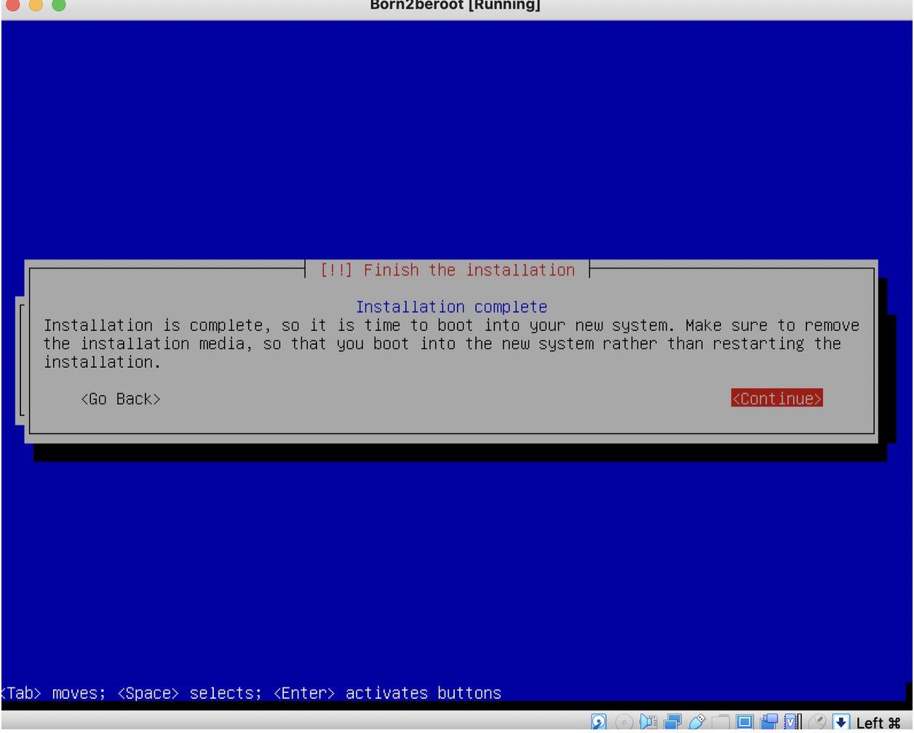

# Born2BeRoot

# 1. Dowload the Virtual Machine ISO
  Download the latest Debian ISO file from the official Debian website to serve as   the operating system for the virtual machine

# 2. Installing the Virtual Machine


## 2.1 Installing Debian
  Install [Debian](https://www.debian.org/download.en.html) as the base operating system for the project. The steps will guide you through configuring the environment and securing the installatio
## 2.2 Virtual Box setup
Install VirtualBox and create a new virtual machine with the recommended settings (e.g., 2GB RAM, 20GB disk).
1. Open Virtual Box and click on New
   
2. Choose Name for the machine and the folder (goinfre) which will be located in
   
3. Select the Total RAM which will be reserved for the machine.
   
4. Choose the recommanded size on storage.
   

## 2.3 Attaching ISO
Attach the downloaded Debian ISO file to the virtual machine’s optical drive to boot and install Debian.
# 3. Istalling Debian

## 3.1 Configure Location
1. We will choose the version without graphical Interface. So we choose the Insallt command. Be aware that we will only use our Keys, so press Enter to Condirm something, the arrows up and down to choose the commands. Use the command key to leave th machine and get your mouse back
   
2. Choose the language for your Virtual machine.
   
3. Select the Country you are in
   
4. Choose the United states
   
5. Now choose your keymap.
   
## 3.2 Configure the Network
1. Set the hostname to be your_login42
   
2. Leave the Domain name blank and press continue. 
   
## 3.3 Setup users and password
!! Save your password as we weill need this later and during your evaluation
1. We have to set the root user password. Press the Space bar on the Show Password in Clear to see your password. Repeat this Process in the next step.
   
2. Set up the user name with your_login. This will be part of the evaluation.
   
3. Repeat this Process again 
   
4. And now we set upt our user password. Write this down aswell.
   

## 3.4 Partioning Disks
Be aware this is a guide for the Non-Bonus part of the Project.
1. Select Guided - use entire disk and set up encrypted LVM.
   
2. We choose the disk to create the partion on.
   
3. Now we want to make the partions as the subjects wants.
   
4. We choose Yes so the changes will be written in the disk.
   
7. In this step we want to input max for the volume group during the guided partioning. You can type in the default aswell. 
   
8. To wrap the Partioning and write the changes to the disk choose Finish partioning
   
9. We choose yes and confirm that we do not want to change anything.
   
## 3.6 Configuring the package Manager
1. We will select No as it is not required to add additional packages.
   
2. We choose again our country
   
3. We choose deb.debian.org as recommended by debian.
   
4. We will leave the HTTP PRoxy blank and continue
   
5. We will select no.
   
6. We want to leave everything blank here aswell. Press space to deselect.
   
## 3.7 Install the Grub boot loader
1. Select Yes to install Grub Boot loader
   
2. Choose /dev/sda for the boot loader installation.
   
3. To finish the Installation press continue
   
## 3.8 Finish Installation
1. To finish we click on continue
   
# 4. Setup the Virtual Machine 

## 4.1 First Connection with VM
1. First of all connect by clicking on Debina GNI/Linux
   

2. Put in you passphrase we created earlier
   
3. Now type in your username and password for this user. It should now look like this.

## 4.2 Installing Sudo & Vim
1. We type in su. With this command we change to the "super user".
   
2. As we want to install sudo and vim we type in. We will now use apt, this is a collection of tools used to install, update, remove and otherwide manage software packages on Debian.
   ```
   apt install sudo && vim
   ```
3. After the installation we will reboot
   ```
   reboot
   ```
4. Once the machine is rebooted we have to do step 4.1 again. We switch to root again.
```
su
```
and then use this command, to check if sudo has been installed correctly
```
sudo -V
```

## 4.3 Configauration of groups
1. We will create a group called user42 which has to be present during the evaluation.
   ```
   sudo addgroup user42
   ```
2. To chekc if the group was created run this command
   ```
   getent group <groupname>
   ```
Now you can see all groups and there members. 

## 4.4 Installing & Configuring SSH
1. We will install the main tool for remote access with SSH protocol using openssh. When we will be asked to confirm, type y. 
   ```
   sudo apt install openssh-server
   ```
2. If you want to check if the installation was succesfull use
   ```
   sudo service ssh status
   ```
3. As we installed vim before. We can now open and configure the sshd_config file
   ```
   su
   vim /etc/ssh/sshd_config
   ```
4. The # will mean that the line is commented; the lines we want to edit need to be uncommented
   ```
   # Port 22 -> Port 4242
   # PermitRootLogin prohibit-password -> PermitRootLogin no
   ```
5. To leave just press :wq to save in quit the file. What we have done no will be important later to connect remotely with our user but also not allowing to connect remotly with root.

6. Now we need to channge the file /etc/ssh/ssh_config (not sshd_config)
   ```
   vim /etc/ssh/ssh_config
   ```
   ```
   # Port22 -> Port4242
   ```
7. Then we will restart the ssh service and check that everything is correct 
   ```
   sudo service ssh restart
   ```
   ```
   sudo serveice ssh status
   ```


## 4.5 Installing & Configuring UFW Firewall 
1. 

## 4.6 Sudo policies 

## 4.7 Password policies

## 4.8 Srcipt

## 4.9 Crontab

## 4.10 Signature.txt

# 5 Evaluation

## 5.1 Evaluation answers

## 5.2 Evaluation Commands 
