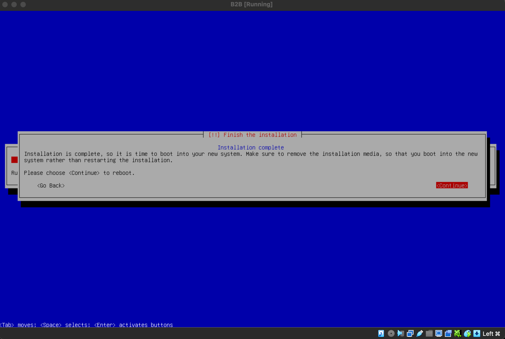

# Born2BeRoot

# 1. Dowload the Virtual Machine ISO
  Download the latest Debian ISO file from the official Debian website to serve as   the operating system for the virtual machine

# 2. Installing the Virtual Machine


## 2.1 Installing Debian
  Install [Debian](https://www.debian.org/download.en.html) as the base operating system for the project. The steps will guide you through configuring the environment and securing the installatio
## 2.2 Virtual Box setup
Install VirtualBox and create a new virtual machine with the recommended settings (e.g., 2GB RAM, 20GB disk).
1. Open Virtual Box and click on New
   
2. Choose Name for the machine and the folder (goinfre) which will be located in
   
3. Select the Total RAM which will be reserved for the machine.
   
4. Choose the recommanded size on storage.
   

## 2.3 Attaching ISO
Attach the downloaded Debian ISO file to the virtual machine’s optical drive to boot and install Debian.
# 3. Istalling Debian

## 3.1 Configure Location
1. We will choose the version without graphical Interface. So we choose the Insallt command. Be aware that we will only use our Keys, so press Enter to Condirm something, the arrows up and down to choose the commands. Use the command key to leave th machine and get your mouse back
   
2. Choose the language for your Virtual machine.
   
3. Select the Country you are in
   
4. Choose the United states
   
5. Now choose your keymap.
   
## 3.2 Configure the Network
1. Set the hostname to be your_login42
   
2. Leave the Domain name blank and press continue. 
   
## 3.3 Setup users and password
!! Save your password as we weill need this later and during your evaluation
1. We have to set the root user password. Press the Space bar on the Show Password in Clear to see your password. Repeat this Process in the next step.
   
2. Set up the user name with your_login. This will be part of the evaluation.
   
3. Repeat this Process again 
   
4. And now we set upt our user password. Write this down aswell.
   

## 3.4 Partioning Disks
Be aware this is a guide for the Non-Bonus part of the Project.
1. Select Guided - use entire disk and set up encrypted LVM.
   
2. We choose the disk to create the partion on.
   
3. Now we want to make the partions as the subjects wants.
   
4. We choose Yes so the changes will be written in the disk.
   
6. Now again we need a passphrase for the LVM encrypt. Write this down aswell.
   
7. In this step we want to input max for the volume group during the guided partioning. You can type in the default aswell. 
   
8. To wrap the Partioning and write the changes to the disk choose Finish partioning
   
9. We choose yes and confirm that we do not want to change anything.
   
## 3.6 Configuring the package Manager
1. We will select No as it is not required to add additional packages.
   
2. We choose again our country
   
3. We choose deb.debian.org as recommended by debian.
   
4. We will leave the HTTP PRoxy blank and continue
   
5. We will select no.
   
6. We want to leave everything blank here aswell. Press space to deselect.
   
## 3.7 Install the Grub boot loader
1. Select Yes to install Grub Boot loader
   
2. Choose /dev/sda for the boot loader installation.
   
3. To finish the Installation press continue
   
## 3.8 Finish Installation
1. To finish we click on continue
   
# 4. Setup the Virtual Machine 

## 4.1 First Connection with VM
1. First of all connect by clicking on Debina GNI/Linux
   

2. Put in you passphrase we created earlier
   
3. Now type in your username and password for this user. It should now look like this.

## 4.2 Installing Sudo & Vim
1. We type in su. With this command we change to the "super user".
   
2. As we want to install sudo and vim we type in. We will now use apt, this is a collection of tools used to install, update, remove and otherwide manage software packages on Debian.
   ```
   apt install sudo && vim
   ```
3. After the installation we will reboot
   ```
   reboot
   ```
4. Once the machine is rebooted we have to do step 4.1 again. We switch to root again.
```
su
```
and then use this command, to check if sudo has been installed correctly
```
sudo -V
```

## 4.3 Configauration of groups
1. We will create a group called user42 which has to be present during the evaluation.
   ```
   sudo addgroup user42
   ```
2. To chekc if the group was created run this command
   ```
   getent group <groupname>
   ```
Now you can see all groups and there members. 

## 4.4 Installing & Configuring SSH
1. We will install the main tool for remote access with SSH protocol using openssh. When we will be asked to confirm, type y. 
   ```
   sudo apt install openssh-server
   ```
2. If you want to check if the installation was succesfull use
   ```
   sudo service ssh status
   ```
3. As we installed vim before. We can now open and configure the sshd_config file
   ```
   su
   vim /etc/ssh/sshd_config
   ```
4. The # will mean that the line is commented; the lines we want to edit need to be uncommented
   ```
   # Port 22 -> Port 4242
   # PermitRootLogin prohibit-password -> PermitRootLogin no
   ```
5. To leave just press :wq to save in quit the file. What we have done no will be important later to connect remotely with our user but also not allowing to connect remotly with root.

6. Now we need to channge the file /etc/ssh/ssh_config (not sshd_config)
   ```
   vim /etc/ssh/ssh_config
   ```
   ```
   # Port22 -> Port4242
   ```
7. Then we will restart the ssh service and check that everything is correct 
   ```
   sudo service ssh restart
   ```
   ```
   sudo serveice ssh status
   ```


8. If you want to connect via SSH, we need to close the machince first, and go to the Settings.
   
9. Afterward click to advanced and to port forwarding. 

10. CLick on the green plus sign to add a new port. and add 4242 to the port host and client.


11. To connect to our virtual machine remotly. Open a terminal. 
    ```
    ssh<user>@localhost -p 4241
    ``
  Your gonna be asked yout password for the user, to login. Your login shoul show green now, if the connection was succesful. Type exit to leave. 
## 4.5 Installing & Configuring UFW Firewall 
1. We need to Install ufw, use this command. Type in y if you get asked and the installation will proceed. 
   ```
   sudo apt install ufw
   ```
2. Once the installation is done, we need to enable the firewall.
   ```
   sudo ufw enable
   ```
3. Next step is to allow the connection by putting in our previous ports
   ```
   sudo ufw allow 4242
   ```
4. To check if everything is correct.
   ```
   sudo ufw status
   ```
## 4.6 Sudo policies 
1. We need to create in /etc/sudoers.d/. This file will store our sudo policies
   ```
   touch /etc/sudoers.d/sudo_config
   ```
2. Afterwards we need to create a directory /var/log/sudo because we want to log every sudo command
   ```
   mkdir /var/log/sudo
   ```
3. Now we are going to edit the file createt previously.
   ```
   vim /etc/sudoers.d/sudo_config
4. The file will need following commands
   ```
   Defaults  passwd_tries=3
   Defaults  badpass_message="Mensaje de error personalizado"
   Defaults  logfile="/var/log/sudo/sudo_config"
   Defaults  log_input, log_output
   Defaults  iolog_dir="/var/log/sudo"
   Defaults  requiretty
   Defaults     secure_path="/usr/local/sbin:/usr/local/bin:/usr/sbin:/usr/bin:/sbin:/bin:/snap/bin"
    ```
   passwd_tries=3: Total tries for entering sudo password.
   badpass_message="password incorrect": This messafe will display when the password is incorrect.
   logfile="/var/log/sudo/sudo_config": This will be the path werre the sudo logs are stored
   log_input, log_output: This will be the information what will be logged.
   iolog_dir="/var/log/sudo" : again what will be logged.
   requiretty: TTY will become required. Sudo commands will just be executable in terminal secure_path="/usr/local/sbin:/usr/local/bin:/usr/sbin:/usr/bin:/sbin:/bin:/snap/bin" : These are the folders that will be excluded by sudo.

## 4.7 Password policies
1. First step will be to edit the login.defs file
   ```
   vim /etc/login.defs
   ```
2. PASS_MAX_DAYS 99999 -> PASS_MAX_DAYS 30
   PASS_MIN_DAYS 0 -> PASS_MIN_DAYS 2
3. To continue the installation we need to install a new package to enforce the password quality.
   ```
   sudo apt install libpam-pwquality
   ```
4. Now we need to edit the file common-password
   ```
   vim /etc/pam.d/common-password
   ```
5. We need to add the following commands
   ```
   minlen=10 ucredit=-1 dcredit=-1 lcredit=-1 maxrepeat=3 reject_username difok=7 enforce_for_root
   ```
minlen=10 ➤ The minimun characters a password must contain.
ucredit=-1 ➤ The password at least have to contain a capital letter. We must write it with a - sign, as is how it knows that's refering to minumum caracters; if we put a + sign it will refer to maximum characters.
dcredit=-1 ➤ The passworld at least have to containt a digit.
lcredit=-1 ➤ The password at least have to contain a lowercase letter.
maxrepeat=3 ➤ The password can not have the same character repited three contiusly times.
reject_username ➤ The password can not contain the username inside itself.
difok=7 ➤ The password it have to containt at least seven diferent characters from the last password ussed.
enforce_for_root ➤ We will implement this password policy to root.

## 4.8 Srcipt
This is going to be a really important part do not just copy and paste. You will need to understand every step, and will be asked to explain your script during the evaluation! 
1. We need to create the script by using this command. Be aware in which folder you put in yout monitoring.sh file
   ```
   touch monitoring.sh
   ```

  ```
  #!/bin/bash

# ARCH
arch=$(uname -a)

# CPU PHYSICAL
cpuf=$(grep "physical id" /proc/cpuinfo | wc -l)

# CPU VIRTUAL
cpuv=$(grep "processor" /proc/cpuinfo | wc -l)

# RAM
ram_total=$(free --mega | awk '$1 == "Mem:" {print $2}')
ram_use=$(free --mega | awk '$1 == "Mem:" {print $3}')
ram_percent=$(free --mega | awk '$1 == "Mem:" {printf("%.2f"), $3/$2*100}')

# DISK
disk_total=$(df -m | grep "/dev/" | grep -v "/boot" | awk '{disk_t += $2} END {printf ("%.1fGb\n"), disk_t/1024}')
disk_use=$(df -m | grep "/dev/" | grep -v "/boot" | awk '{disk_u += $3} END {print disk_u}')
disk_percent=$(df -m | grep "/dev/" | grep -v "/boot" | awk '{disk_u += $3} {disk_t+= $2} END {printf("%d"), disk_u/disk_t*100}')

# CPU LOAD
cpul=$(vmstat 1 2 | tail -1 | awk '{printf $15}')
cpu_op=$(expr 100 - $cpul)
cpu_fin=$(printf "%.1f" $cpu_op)

# LAST BOOT
lb=$(who -b | awk '$1 == "system" {print $3 " " $4}')

# LVM USE
lvmu=$(if [ $(lsblk | grep "lvm" | wc -l) -gt 0 ]; then echo yes; else echo no; fi)

# TCP CONNEXIONS
tcpc=$(ss -ta | grep ESTAB | wc -l)

# USER LOG
ulog=$(users | wc -w)

# NETWORK
ip=$(hostname -I)
mac=$(ip link | grep "link/ether" | awk '{print $2}')

# SUDO
cmnd=$(journalctl _COMM=sudo | grep COMMAND | wc -l)

wall "	Architecture: $arch
	CPU physical: $cpuf
	vCPU: $cpuv
	Memory Usage: $ram_use/${ram_total}MB ($ram_percent%)
	Disk Usage: $disk_use/${disk_total} ($disk_percent%)
	CPU load: $cpu_fin%
	Last boot: $lb
	LVM use: $lvmu
	Connections TCP: $tcpc ESTABLISHED
	User log: $ulog
	Network: IP $ip ($mac)
	Sudo: $cmnd cmd"
```
### Script explanation
1. System architecute (arch)
   This will retireve the system architecture and kernel verion usinf the uname -a command.
2. Physical CPU Count (cpuf)
   This will count the number of physical CPUs by checking /proc/cpuinfo for entries labeled as "physical id"
3. Virtual CPU Count (cpuv)
   Counts the number of virtul CPUs (threads) by finding "processer" entries in /proc/cpuinfo
4. RAM usage (ram_total, ram_use, ram_percent)
   ram_total: Total ram in MB.
   ram_use: Ram currently in use in MB.
   ram_percent: Percentage of RAM used.
5. Disk Usage(disk_total, disk_use, disk_percent)
   disk_total: Total disk space in GB excluding the /boot partion.
   disk_use: Disk space currently in use in MB.
   disk_percent: Percentage of disk space used.
6. CPU Load(cpu_fin)
   cpul: CPU idle percentage using vmstat
   cpu_fin: CPU usage percentage(calculated as 100 - idle)
7. Last Boot Time(lb)
   Displays the systems last boot time using who -b.
8. LVM Use(lvmu)
   Checks if logical volume manager is being used by searchin for "lvm" in lsblk
9. TCP Connections (tcpc)
    Counts the number of establsihed TCP connections using the ss command
10. Logged in Users (ulog)
    Counts the numbers of currently logged in usrers
11. Network Information(ip, mac)
    ip: retrieves the systems IP Adress
    mac: Gets the MAC adress of the network interface
12. Sudo Commands Count(cmnd)
    Counts the number of sudo commands executed by parsing the system journal for sudo entries.
13. Displaying the information
    Uses Wall command to broadcast the system information to all logged in users.

## 4.9 Crontab
1. To configure crontav we use following command
   ```
   sudo crontab -u root -e
   ```
2. In the file we must add the following command for the script to execute every 10 minutes.
   ```
   */10 * * * * sh/path_to_file.sh
   `` 
## 4.10 Signature.txt
To get the signature, we first need to shutdown our virtual Machine. Be aware that if you want to change something again in your VM the signature will change.
1. Go to your folder in which you have your .vdi file
2. Finaly we will run shasum yourmachin.vdi to obtain our Signature. The result of our shasum will be copied into a created signature.txt file, which we tehn will push into our intra repository. 
As I said before after you pushed your signature.txt it is very important to not change anything in Your virtual Machine again, as this will cause a new siganture. 


# 5 Evaluation

## 5.1 Evaluation answers

## 5.2 Evaluation Commands 
